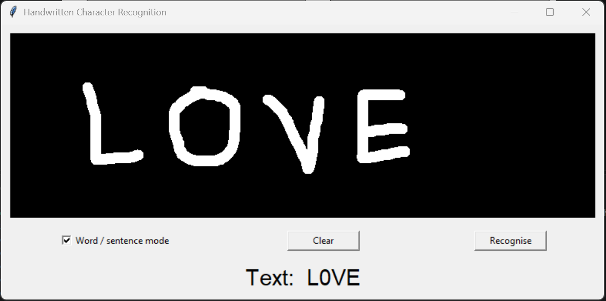
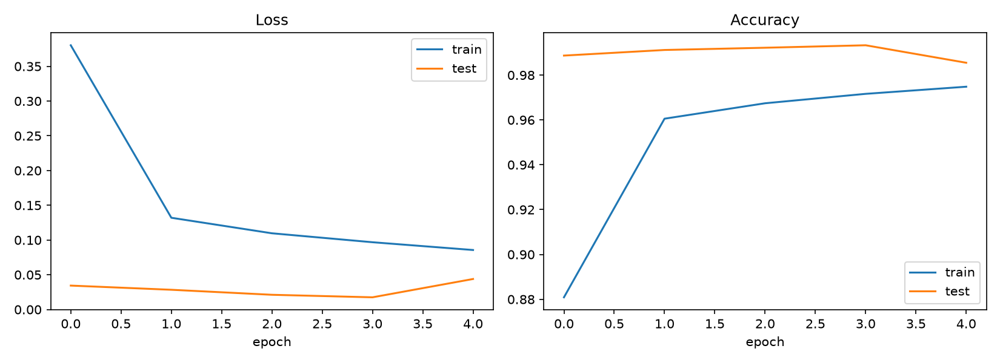
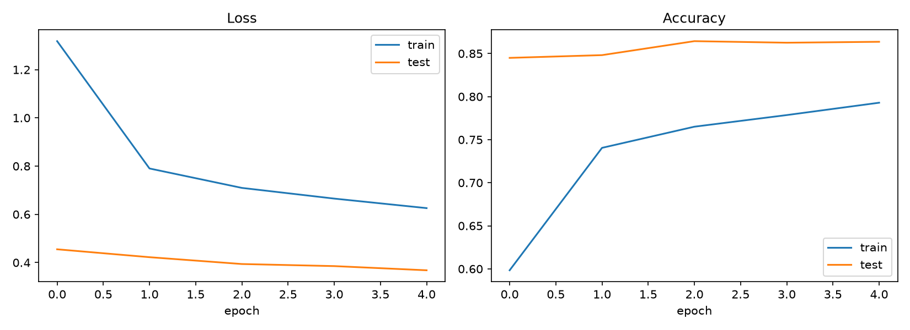
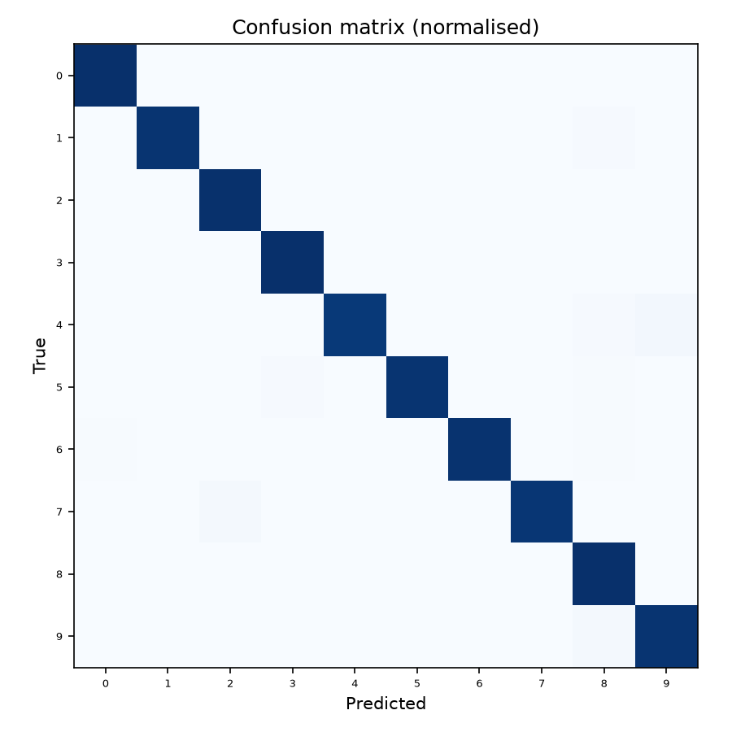
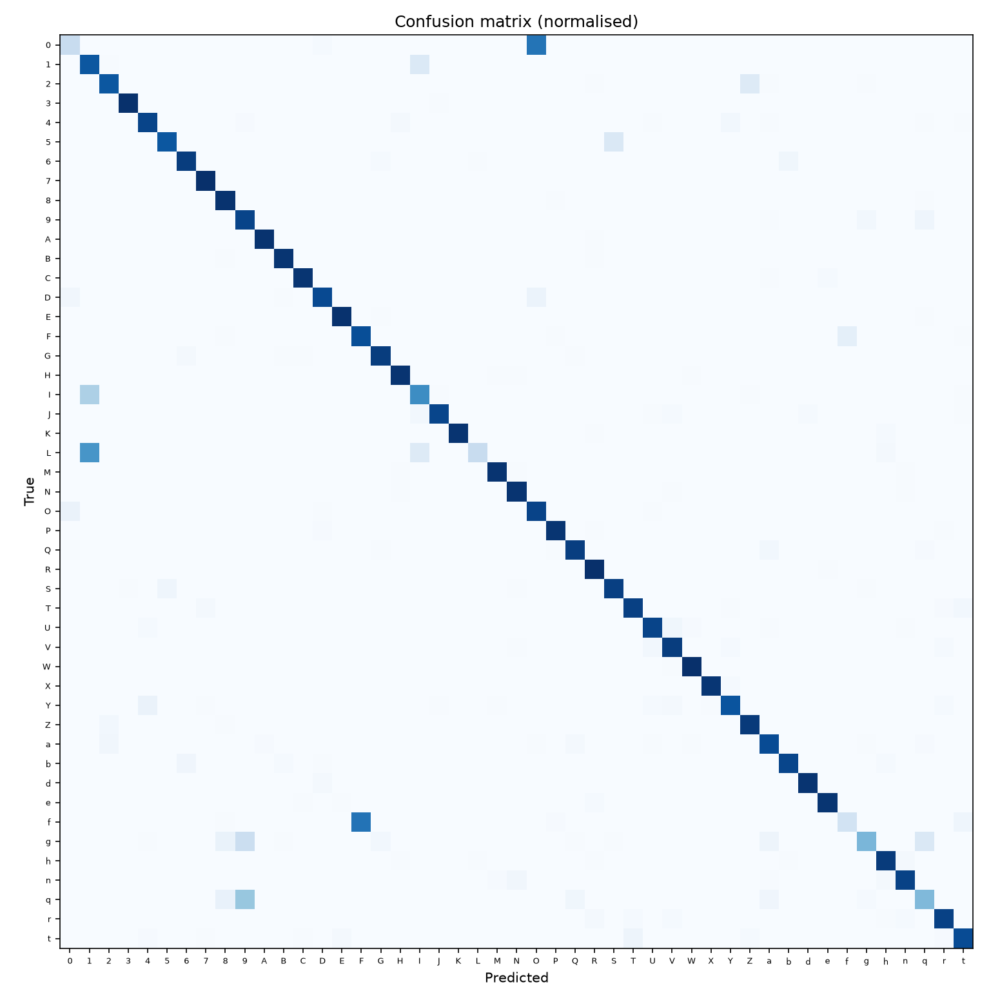

# ✍️ Handwritten Character Recognition (CNN + CRNN)

A deep-learning project that recognises handwritten **digits** (MNIST) and **letters** (EMNIST) using a Convolutional Neural Network built in PyTorch. It includes an interactive drawing app that reads single characters, words and short sentences, plus a CRNN extension for sequence recognition.

## ✨ Features

- **CNN classifier** with BatchNorm, Dropout and data augmentation (rotation, shift, zoom)
- Supports **MNIST** (10 digits) and **EMNIST** (26 letters / 47 balanced / 62 digits + upper + lower)
- **Image preprocessing pipeline** (grayscale → invert → crop → resize → centre) so drawings match the training format
- **Live drawing app**: draw with your mouse and see the prediction instantly
- **Word / sentence mode** that splits handwriting into characters and detects spaces
- **CRNN extension** (CNN + BiLSTM + CTC loss) for reading whole sequences, the foundation for word and sentence recognition
- Auto-generated **training curves, confusion matrices and per-class reports**

## 🎥 Demo



## 🗂️ Project Structure

```
handwritten-character-recognition/
├── app.py               # Interactive drawing demo (Tkinter)
├── requirements.txt
├── src/
│   ├── data.py          # MNIST / EMNIST loading + augmentation
│   ├── model.py         # CharCNN architecture
│   ├── train.py         # Training + evaluation + plots
│   ├── predict.py       # Preprocessing + inference (CLI and importable)
│   ├── word.py          # Segmentation-based word/sentence recognition
│   └── crnn.py          # CRNN + CTC sequence recognition demo
├── models/              # Saved weights (created after training)
└── results/             # Curves, confusion matrices, reports
```

## 🚀 Getting Started

**1. Get the code** and open a terminal in the project folder (the one containing `app.py`).

**2. Create and activate a virtual environment**

```bash
python -m venv .venv

# Windows (PowerShell)
.venv\Scripts\activate
# macOS / Linux
source .venv/bin/activate
```

> On Windows, if PowerShell says "running scripts is disabled", run
> `Set-ExecutionPolicy -Scope CurrentUser -ExecutionPolicy RemoteSigned` once and activate again.

**3. Install dependencies**

```bash
pip install -r requirements.txt
```

### Train

```bash
# Digits
python -m src.train --dataset mnist --epochs 5

# Digits + letters (47 classes)
python -m src.train --dataset emnist_balanced --epochs 5

# Other options: emnist_letters (A–Z), emnist_byclass (62 classes)
```

Datasets download automatically on first run. A GPU is used if available, otherwise the CPU. Trained models are saved to `models/` and plots and reports to `results/`.

### Run the drawing app

```bash
python app.py --model models/emnist_balanced.pt
```

Draw capital letters with a small gap between letters and a bigger gap between words. Untick **Word / sentence mode** to classify a single character instead.

### Predict from an image file

```bash
python -m src.predict my_image.png --model models/mnist.pt
```

### Sequence recognition (CRNN demo)

```bash
python -m src.crnn --epochs 5
```

## 🧠 How It Works

### CNN architecture

| Block | Layers |
|-------|--------|
| 1 | Conv(32) → BN → ReLU → Conv(32) → BN → ReLU → MaxPool → Dropout(0.25) |
| 2 | Conv(64) → BN → ReLU → Conv(64) → BN → ReLU → MaxPool → Dropout(0.25) |
| Head | Flatten → Dense(256) → Dropout(0.5) → Dense(num_classes) |

Trained with the Adam optimiser (learning rate 1e-3, step decay) and cross-entropy loss.

### Preprocessing for real-world input

Models trained on MNIST/EMNIST expect white strokes on a black 28×28 canvas, with the character centred in a 20×20 box. `predict.preprocess()` reproduces this for any input image, which is what makes the drawing app work well.

### Word / sentence recognition

`src/word.py` finds the gaps in the ink along the horizontal axis, cuts the drawing into individual characters, classifies each with the CNN, and inserts a space wherever the gap is much wider than a typical letter. This works well for letters written separately (print style).

### Extending to cursive and real handwriting (CRNN)

Segmentation can't handle touching or cursive letters, because character boundaries are unknown. A CRNN solves this:

1. **CNN** extracts features along the image width
2. **Bidirectional LSTM** models context across the sequence
3. **CTC loss** aligns predictions to the label without per-character segmentation

`src/crnn.py` demonstrates the idea on synthetic digit strings built from MNIST. The same pipeline can be trained on word and line datasets such as **IAM**.

## 📊 Results

| Dataset | Classes | Epochs | Test Accuracy |
|---------|---------|--------|---------------|
| MNIST (digits) | 10 | 5 | **99.33%** |
| EMNIST Balanced (digits + letters) | 47 | 5 | **86.44%** |

Trained on CPU with Adam (lr 1e-3) and light data augmentation.

### Training curves




### Confusion matrices




### Observations

- MNIST reaches over 99% accuracy within 5 epochs.
- EMNIST Balanced is harder, because many characters look alike (for example `0`/`O`, `1`/`I`, `S`/`5`). The balanced split also merges some upper- and lowercase letters into one class, so most errors fall between visually similar characters. The confusion matrix shows this.
- Accuracy was still improving at epoch 5, so longer training would likely help.

## ⚠️ Limitations

- Word/sentence mode works for letters written separately. Touching or cursive letters can't be split by the segmentation step.
- EMNIST Balanced treats some uppercase and lowercase letters as one class, so output is mostly uppercase.
- The CRNN in `src/crnn.py` is a proof of concept on synthetic digit strings, not trained on real handwritten words.

## 🔭 Future Improvements

- Train the CRNN on IAM for real handwritten words and lines
- Add a beam-search decoder with a language model
- Resolve digit/letter confusion using word context
- Export to ONNX / TensorFlow Lite for mobile
- Web demo with Streamlit or Gradio

## 🛠️ Tech Stack

Python · PyTorch · torchvision · NumPy · scikit-learn · Matplotlib · Pillow · Tkinter

## 📚 References

- LeCun et al., *MNIST handwritten digit database*
- Cohen et al., *EMNIST: an extension of MNIST to handwritten letters* (2017)
- Shi et al., *An End-to-End Trainable Neural Network for Image-based Sequence Recognition* (CRNN, 2015)

## 📄 License

MIT